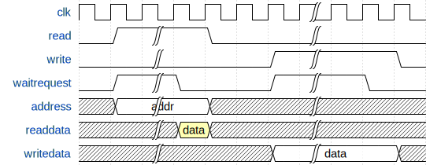
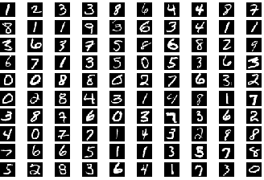

# Deep Neural Networks on FPGA

## Contents

* [Background](#background)
  * [Deep neural networks](#deep-neural-networks)
  * [Q16\.16 fixed point](#q1616-fixed-point)
* [Design](#design)
  * [Task 1: Tutorials](#task-1-tutorials)
  * [Task 2: PLL and SDRAM controller](#task-2-pll-and-sdram-controller)
  * [Task 3: Simulation](#task-3-simulation)
  * [Task 4: A memory copy accelerator](#task-4-a-memory-copy-accelerator)
  * [Task 5: A basic deep neural network accelerator](#task-5-a-basic-deep-neural-network-accelerator)
  * [Task 6: A slightly optimized deep neural network accelerator](#task-6-a-slightly-optimized-deep-neural-network-accelerator)
* [Additional specifications](#additional-specifications)
  * [Avalon protocol variant](#avalon-protocol-variant)
  * [Memory map](#memory-map)
  * [Test inputs](#test-inputs)
  * [Common problems](#common-problems)
* [Deliverables and evaluation](#deliverables-and-evaluation)
  * [Automatic testing](#automatic-testing)
  * [Marks](#marks)
  * [Task 4 [4 marks]](#task-4-4-marks)
  * [Task 5 [3 marks]](#task-5-3-marks)
  * [Task 6 [3 marks]](#task-6-3-marks)


## Background

In this lab, you will build a deep neural network accelerator for an embedded Nios II system. You will also learn how to interface with off-chip SDRAM, and how to use a PLL to generate clocks with specific properties.

The RTL designs you will write are simple and fairly straightforward. The challenge comes from the system-on-chip component: you will build an entire system with an embedded softcore CPU. This means that you need to understand and carefully implement the interconnect protocol — otherwise your system will not work.

Because the system as a whole is more complex than the systems we've built before, it will be _extra_ important to write extensive unit tests and carefully debug all the pieces of your design before you connect them together.


### Deep neural networks

We will use a type of neural network called a multi-layer perceptron (MLP) to classify the MNIST hand-written digit dataset. That is, our MLP will take a 28×28-pixel greyscale image as input and determine which digit (0..9) this image corresponds to.

An MLP consists of several linear layers that first multiply the previous layer's outputs by a weight matrix and add a constant “bias” value to each output, and then apply a non-linear activation function to obtain the current layer's outputs (called activations). Our MLP will have a 784-pixel input (the 28×28-pixel image), two 1000-neuron hidden layers, and a 10-neuron output layer; the output neuron with the highest value will tell us which digit the network thinks it sees. For the activation function, we will use the rectified linear unit (ReLU), which maps all negative numbers to 0 and all positive numbers to themselves.

During inference, each layer computes _a'_ = ReLU(_W_·_a_+_b_), where _W_ is the weight matrix, _a_ is the vector of the prior layer's activations, _b_ is the bias vector, and _a'_ is the current layer's activation vector. You might find [3Blue1Brown's neural network video](https://www.youtube.com/watch?v=aircAruvnKk) an excellent introduction to how the math works.

Do not be discouraged by fancy terms like neural networks — you are essentially building an accelerator to do matrix-vector multiplication. Most of the challenge here comes from interacting with the off-chip SDRAM memory and correctly handling signals like _waitrequest_ and _readdatavalid_.

You don't need to know how these networks are trained, since we have trained the network for you and pre-formatted the images (see the contents of the `data` folder, and the [list of test inputs](#test-inputs)). If you are curious, however, you can look in `scripts/train.py` to see how we trained the MLP.


### Q16.16 fixed point

In this lab, we will use **signed Q16** fixed-point numbers to represent all biases, activations, weights, etc.

This format works as follows. The complete number takes 32 bits: bit [31] represents the sign bit, bits [30:16] represent the integral part, and bits [15:0] are the fractional part. You can think of it as having a 32-bit two's-complement integer, but agreeing that the values we see really stand for the integers _divided by 65,536_. This format is commonly referred to as the [Q format](https://en.wikipedia.org/wiki/Q_(number_format)); specifically, we will use Q16.16.

Computations on Q16.16 are performed by doing the actual operation on the 32-bit quanitity as if the numbers were integers, and then adjusting the fractional point in the result as required. Because the fractional point in Q16.16 is _fixed_, the only way to move the fractional point is to _shift the result_ as necessary to put the result back in the Q16.16 format, applying rounding as necessary (see below). To gain some intuition into this, try this out with some base-10 numbers: for example, try operations like addition, multiplication, and division with numbers like 1234, 123.4, 12.34, and so on, and find out where the decimal point goes.

For the purposes of this lab, conversion from Q16.16 to an integer is done by **rounding**: for example,

| real number _n_ | rounded to |
| --------------- | ---------- |
| 0 ≤ _n_ < 0.5   | 0          |
| 0.5 ≤ _n_ ≤ 1   | 1          |
| –0.5 < _n_ ≤ 0  | 0          |
| –1 ≤ _n_ ≤ –0.5 | –1         |


### Timing constraints

In this lab, you will need to include _timing constraints_ to make sure Quartus meets our desired clock frequency. You can do this by adding the constraints file `settings/timing.sdc` to your Quartus project; it will be automatically used by the Timing Analyzer.


## Design

### Task 1: Tutorials

First, install the Intel FPGA Monitor Program from [Intel's University Program site](https://www.intel.com/content/www/us/en/programmable/support/training/university/materials-software.html). You will likely need version 17.1 of the FPGA Monitor tool — version 18.1 worked correctly for me on a small design, but failed with the full lab.

Complete the following tutorials on Intel's DE boards tutorial site: ftp://ftp.intel.com/Pub/fpgaup/pub/Intel_Material/17.1/Tutorials/

- Introduction to the Platform Designer Tool: ftp://ftp.intel.com/Pub/fpgaup/pub/Intel_Material/17.1/Tutorials/Introduction_to_the_Qsys_Tool.pdf
- Making Platform Designer Components: ftp://ftp.intel.com/Pub/fpgaup/pub/Intel_Material/17.1/Tutorials/making_qsys_components.pdf
- Intel FPGA Monitor Program Tutorial for Nios II: ftp://ftp.intel.com/Pub/fpgaup/pub/Intel_Material/17.1/Tutorials/Intel_FPGA_Monitor_Program_NiosII.pdf

These tutorials describe how to build a Nios II-based SoC system, how to build components that hang off the Avalon on-chip interconnect, and how to run program on the Nios II core when you have a physical FPGA.

Note that the nomenclature in these tools has changed somewhat over the past few years, so you may need to pay attention to the following:

- _Platform Designer_ used to be called _Qsys_.
- You will need to use the _Nios II processor_, not the _Nios II Classic_ (which may be gone).
- Only the _Nios II/e_ and _Nios II/f_ may be available in Platform Designer; use the _II/e_.
- The processor instance name may slightly different (contains _gen_ instead of _qsys_).
- The processor interface beginning with _jtag_ may now start with _debug_. Everything else is the same, though: there is still a reset interface and a memory-mapped slave interface.
- The reset polarity of some components may have changed. The toplevel is still active-low, though, so you don't need to change anything.
- The IP variation file you need to import into Quartus may have a `.qsys` extension, not `.qip`.
- The Monitor-generated `makefile` was buggy for me in 18.1 because target names were capitalized incorrectly — I had to add the following lines to it:
```
compile: COMPILE
clean: CLEAN
```

If your tutorial does not work, carefully check every step. It's easy to miss a small part and then wonder why absolutely nothing works.

You might also find it useful to refer to the following documents:

- [Avalon Interface Specifications](https://www.intel.com/content/dam/www/programmable/us/en/pdfs/literature/manual/mnl_avalon_spec.pdf) (only sections 1–3 are relevant to us)
- Introduction to the Intel Nios II Soft Processor: ftp://ftp.intel.com/Pub/fpgaup/pub/Intel_Material/17.1/Tutorials/Nios2_introduction.pdf
- [Nios II Processor Reference Guide](https://www.intel.com/content/dam/www/programmable/us/en/pdfs/literature/hb/nios2/n2cpu-nii5v1gen2.pdf)
- [Nios II Software Developer Handbook](https://www.intel.com/content/dam/www/programmable/us/en/pdfs/literature/hb/nios2/n2sw_nii5v2gen2.pdf)

Note that the Avalon memory-mapped spec includes many signals, but you generally only need to connect the subset you are using. In the rest of this lab, the module templates we provided to get you started specify the set of wires you actually need to connect.

Task 1 has no deliverable files, but you need to understand how to build and debug an embedded system for the remainder of the lab.


### Task 2: PLL and SDRAM controller

Now, we will create a Nios II system that accesses the external SDRAM on your DE1-SoC board. First, create a Nios II system using Platform Designer, as above, except called `dnn_accel_system`. Include a JTAG module as well as a 32KB on-chip memory; both should be connected to the instruction and data masters. Set the reset and interrupt vectors to the on-chip memory, at the default offsets of 0x0 and 0x20.

Refer to the [memory map](#memory-map) for the address ranges; you will add more components in the rest of the lab.

#### PLL

Next, add a phase-locked loop (PLL) IP to your system. Set up your PLL to have a 50MHz reference clock and two output clocks:

- `outclk0`, a 50MHz clock with a phase shift of 0ps, which will drive most of our design
- `outclk1`, a 50MHz clock with a phase shift of -3000ps, which will connect to the SDRAM chip (this accounts for things like the wiring between the FPGA and the SDRAM)

Also, enable the PLL locked output. Leave all other settings at their default values.

In Platform Designer, Export `outclk1` as `sdram_clk` and the `locked` signal as `pll_locked`. Connect the `refclk` input to the PLL to the default clock source (`clk_0.clk`) and the `reset` input to the PLL to the default reset source (`clk_0.clk_reset`). **Do not** connect the PLL's reset to the debug master — otherwise your system will lose the clock every time the Monitor program tries to reset your CPU! Connect `outclk0` as the clock input to all other modules except for `clk_0` — this includes the CPU, the SDRAM controller, and all other modules you will add later.

#### SDRAM controller

Next, add an SDRAM controller to your system. To match the SDRAM on the DE1-SoC, you will need to use the following settings when generating the controller:

|  parameter   |   setting  |
| ------------ | ---------- |
| data width   | 16 bits    |
| row width    | 13 bits    |
| column width | 10 bits    |
| refresh      | 7.8125µs   |
| t_rp         | 15.0ns     |
| t_rcd        | 15.0ns     |
| t_ac         | 5.4ns      |
| base address | 0x08000000 |

Also activate the _Include functional memory model in the system testbench_ box. Leave all other settings at their default values.

Export the `wire` conduit interface of the controller as `sdram`; these are the signals you will connect to the FPGA pins that go to the off-chip SDRAM.

Note that the CPU's instruction master **should not** be connected to the SDRAM controller; we will read instructions from on-chip memory.

#### Output PIO

Finally, add a parallel I/O (PIO) module with a 7-bit output port and reset value 0x7f. Export this port as `hex` — we will use it to display the recognized digit.

#### Generating the testbench

After you generate the HDL in Platform Designer as in the tutorials, navigate to _Generate&rarr;Generate Testbench System_. This will generate a funtional model for the SDRAM, which you will need for simulation.

#### The rest

We have provided a toplevel `task2.sv` for you, which instantiates your system and connects it to the SDRAM and the 7-segment display. We have also provided `run_nn.c`, the C file you will use to test your system. (Isn't that refreshing?)

After compiling and loading the program, you will need to download the neural network's weights and an input image to the off-chip memory. You can do this by choosing _Actions&rarr;Load file into memory_. Specifically, load the following as _binary files_:

- `nn.bin` at address 0x0a000000 (this will take a bit of time)
- one of the test images (e.g., `test_00.bin`) at address 0x0a800000 (this is quick)

Finally, you can run the file to evaluate the neural network on the input image by running the program. Keep in mind that the generated Nios II processor is _very_ slow,

This task has no deliverables.

#### Tips

You can use `xxd nn.bin | less` on Mac/Linux or `format-hex nn.bin | out-host -paging` in Windows Powershell to examine binary files, and check that you loaded them correctly under the _Memory_ tab of the Monitor Program. Note that the files themselves are in _little-endian_ byte order but both `xxd` and `format-hex` show them as _big-endian_ while the Monitor shows them as _little-endian_.

Don't accidentally connect the debug reset to the PLL. If you do, the Monitor program will reset the PLL (and lose all clocks) every time it tries to reset the CPU, and you will never be able to run anything.


### Task 3: Simulation

#### Nios II system

To simulate the system in Modelsim, you will need to add the following files to your Modelsim project:

- `nios_system/simulation/submodules/*.v`
- `nios_system/simulation/submodules/*.sv`
- `nios_system/simulation/nios_system.v`

(where `nios_system` is whatever you told Platform Designer to call the generated system).

You will also need to copy these files into the directory where you are simulating:

- `nios_system/simulation/submodules/*.hex`

These are memory image files for all the CPU internal memories (e.g., register file) as well as the main memory you created.

For simulation, you will also want to tell Modelsim to use the `altera_mf_ver` library, and `cyclonev_ver`, `altera_ver`, and `altera_lnsim_ver` for netlist simulation.

When you simulate your design, you may see a large number of warnings. Some of them are due to the Platform Designer being sloppy:

- Some warnings in `nios_system.v` about missing connections for some JTAG ports. We will not be using these in simulation so we don't need to worry about it.
- Lots of warnings in `nios_system_nios2_gen2_cpu.v` about missing memory block connections, such as `wren_b`, `rden_a`, etc. This is because the generated Nios II CPU uses embedded memories for things like the register file, and does not connect some of the ports. (It works fine because the instantiation parameters configure the memory so that these ports are not used inside, but ModelSim does not know about that.) You may ignore those warnings.
- A few warnings about `DONTCARE` and Stratix devices. Ours is a Cyclone V FPGA, so we couldn't care less.

Be sure to go through the warnings and make sure that none of them refer to **your** modules. It's easy to miss important issues in the sea of spurious warnings raised by the generated system and spend hours upon hours debugging.

Write a testbench that provides clock and reset, and simulate the system. You will find that not very much interesting is happening. Look at the signals `nios2_gen2_0_instruction_master_address`, `nios2_gen2_0_instruction_master_readdata`, and `nios2_gen2_0_instruction_master_read` — these connect to the on-chip Avalon interconnect to read instructions from the on-chip memory.

To make life a little more interesting, open the FPGA Monitor program and write a short program that sets the LEDs to some value. Once the program is compiled, select _Actions &rarr; Convert Program to Hex File_; this will create an image of the program memory you can load in simulation. Replace the `nios_system_onchip_memory2_0.hex` with this file (alternatively, you can re-generate the memory with an initalization file and re-synthesize, but that takes longer).

Here is an example of such a program in Nios II assembly:

```assembly
main:
    movui r2, 0xaa
    movui r3, <led address here>
    stw r2, 0(r3)
loop:
    beq zero, zero, loop
```

This tells the CPU to write 0xaa to the memory address where your LED module is mapped. If you did the Platform Designer tutorial correctly and followed the [Memory Map](#memory-map), you should see the `leds` bus in the waveforms change to `10101010` some cycles after the CPU was reset.

Now look again at the signals `nios2_gen2_0_instruction_master_address`, `nios2_gen2_0_instruction_master_readdata`, and `nios2_gen2_0_instruction_master_read`. You should find that the CPU reads addresses four sequential address (4-byte stride), and gets stuck at the `beq` instruction (our infinite loop). You can also observe the `*_data_master_*` signals, and see the moment where 0xaa is written to the LED address. This is also a good opportunity to confirm your understanding of how the Avalon master-slave interface works, including our good friend `waitrequest`.

#### SDRAM

In simulations, we need a way to simulate the DRAM module in the testbench and connect it to the DUT. Luckily Platform Designer provides a generic SDRAM simulation model, which you can use as follows:

1. When generating the SDRAM controller, make sure you enable “Include a functional memory model in the system testbench”
2. In addition to generating the system hardware (as usual), also generate a testbench for the system, which will include the SDRAM simulation model: _Generate&rarr;Generate Testbench System_.
3. The SDRAM simulation model can now be found at <your project dir>/<system name>/testbench/<system name>_tb/simulation/submodules/altera_sdram_partner_module.v
4. An example testbench that instantiates the SDRAM simulation model is found at <your project dir>/<system name>/testbench/<system name>_tb/simulation/<system_name>_tb.v
6. In simulations, the DRAM will be initialized from the file “altera_sdram_partner_module.dat” in the simulation directory. This is just a `$readmem`-readable file. You can overwrite it with your own.

We have provided `.dat` versions of the `.bin` files for the neural network model and the test images. Before you can use them, however, you need to change the offset within the SDRAM to where you want to store the data — this is the lines that begin with `@`. Provided memory regions don't overlap, you can concatenate several of these files together; this can be useful to, e.g., switch among different inputs quickly.

In general, to convert a binary file to format suitable for `$readmemh()`, you can run
```
objcopy -I binary -O verilog --verilog-data-width 2 test_00.bin out.v
```
(this requires a very recent version of `bintools`).


#### Debugging the NIOS program in simulation:

The Intel FPGA Monitor program has some debugging features that you can use to step through the code and examine registers if you are using the physical board. You can’t use the Intel FPGA Monitor Program to do this in simulation, but you can gather similar information from the simulation:

- Reading the register file: You can view the register file of the NIOS by going to _Windows&rarr;Memory List_ and selecting the instance `*/nios2_gen2_0/cpu/*cpu_register_bank_a/*/mem_data`
- Viewing the current instruction: `*/dut/nios2_gen2_0/i_readdata` is the data being sent from the on-chip instruction memory to the CPU. Decode these binary values based on the [Nios II Instruction Set Reference](https://www.intel.com/content/dam/www/programmable/us/en/pdfs/literature/hb/nios2/n2cpu_nii51017.pdf).

A program to read through the SDRAM and write each value to the hex output, to make sure that both memories are being accessed properly and are initialized correctly:

```assembly
main:
    movia r3, 0x00001010
    movia r4, 0x08000000
    movui r2, 0x00
    stw r2, 0(r3)
loop:
    addi r4, r4, 1
    ldbio r5, 0(r4)
    stw r5, 0(r3)
    beq zero, zero, loop
```

Note that you should not hope to run the DNN inference task to completion in simulation — it's just way too slow. Instead, you will have to figure out the first few output activations and monitor the relevant DRAM region to see what is happening.

Task 3 has no deliverables.


### Task 4: A memory copy accelerator

Design an IP component that copies a range of words from one address in SDRAM to another. It will have an Avalon memory-mapped slave interface (to accept commands from the CPU) and an Avalon memory-mapped master interface (to interact with the SDRAM). Such capability is often called DMA copy, the point being to do the memory transfer without involving the CPU, which presumably could be doing something more interesting in parallel.

To start the copying process, the processor will first set up the transfer by writing the byte address of the destination range to word offset 1 in the accelerator's address range, the source byte address to word offset 2, and the number of 32-bit words to copy to word offset 3. Next, the CPU will write any value to word offset 0 to start the copy process. Finally, the CPU will read offset 0 to make sure the copy process has finished. In a nutshell:

| word |                       meaning                      |
| ---- | -------------------------------------------------- |
|   0  | when written, starts accelerator; may also be read |
|   1  | destination byte address                           |
|   2  | source byte address                                |
|   3  | number of 32-bit words to copy                     |

If offsets 1, 2, or 3 are not changed between two writes to offset 0, they keep their previous values; that is, the user should be able to change only the destination address to make multiple copies of the same source data, and so on.

All of the pointers will be byte addresses, but they will be aligned on 32-bit boundaries (i.e., your core does not need to handle unaligned accesses). Conveniently, the SDRAM controller also operates with byte addresses. The `run_nn.c` file contains some code you can run to test your accelerator.

Refer to the [memory map](#memory-map) for this accelerator's address range.

Make sure you understand the functions of _readdatavalid_ and _waitrequest_ that are part of the master interface; they are documented in the Avalon spec. In particular, the SDRAM controller may not respond to read requests immediately — for example, it could be busy refreshing the DRAM or opening a new row — and it might not be able to accept request all of the time, so you will have to ensure that you don't read bogus data and don't drop requests on the floor. (Conversely, observe that there is no _readdatavalid_ on your module's slave interface.)

Also note how the CPU ensures the copy process has finished: it _reads_ offset 0 in your device's address range. This means that you must arrange for this access to _stall_ until the copy is complete. Make sure you understand how _waitrequest_ works. Also, your accelerator must be able to handle repeated requests, so make sure it does not lock up after handling one request.

You will find the module skeleton in `wordcopy.sv`, and your RTL testsuite will go in `tb_rtl_wordcopy.sv`. Note that you may have to mock any modules required to thoroughly test your design, including the SDRAM controller Avalon interface. You **do not** need to mock the actual SDRAM protocol, just the interface to the controller.

Fun fact: a slightly more sophisticated version of this accelerator (i.e., one that supports unaligned accesses and bitmasks) is called a _blitter_. Blitter hardware was used to accelerate graphics processing, originally in the Xerox Alto computer and later in the Commodore Amiga and arcade games.


### Task 5: A basic deep neural network accelerator

In this task, you will design a deep neural network accelerator core. This sounds fancy but is basically a vector-vector dot product accelerator that computes the inner product _w_·_a_, adds a bias _b_, and optionally applies the ReLU activation function to the result.

The main difference from previous labs is that our core will receive memory addresses where the weights, biases, and activations are located, rather than being given values directly. This means that it will need to make memory requests using the Avalon memory-mapped master interface.

To set up the computation, the CPU will write addresses of the bias vector, weight matrix, input and output activations, and the input activation vector length to the following word offsets in your component's address range:

| word |                       meaning                      |
| ---- | -------------------------------------------------- |
|   0  | when written, starts accelerator; may also be read |
|   1  | bias vector byte address                           |
|   2  | weight matrix byte address                         |
|   3  | input activations vector byte address              |
|   4  | output activations vector byte address             |
|   5  | input activations vector length                    |
|   6  | _reserved_                                         |
|   7  | activation function: 1 if ReLU, 0 if identity      |

It will also write 1 to word offset 7 if the ReLU activation function is to be used after the dot product has been computed, or 0 if no activation function is to be applied.

As with the word copy accelerator, you must use _waitrequest_ appropriately to stall subsequent memory accesses to your accelerator's address range until the dot product computation (and possibly the activation) is finished.

Your component must handle multiple requests; otherwise you won't be able to use it repeatedly to compute the full matrix-vector product. If offsets 1–7 are not changed between two writes to offset 0, they keep their previous values; for example, the user should be able to set the input activations address and the input activations vector length once and make several request to your component.

All weights, biases, and activations here are in **signed Q16 fixed point**. Make sure you account for this appropriately when multiplying numbers.

You will find the module skeleton in `dnn.sv`, and your RTL testsuite will go in `tb_rtl_dnn.sv`. Note that you will have to mock any modules required to thoroughly test your design, including the SDRAM controller interface. The `run_nn.c` file we provided in Task 2 already contains a function that uses your accelerator to compute a matrix-vector product.


### Task 6: A slightly optimized deep neural network accelerator

In this task, you will optimize your DNN accelerator to reuse fetched input activations, and get a flavour of how a computer architect thinks.

When designing a high-performance, energy-efficient DNN accelerator, _reuse_ is a key aspect. This is because (usually) these accelerators, like yours, are connected to an external SDRAM — and DRAMs are slow and costly to access in terms of energy in comparison to on-chip SRAM. It is therefore more energy-efficient — and faster — to identify data that can be reused, copy it from DRAM to on-chip SRAM, and read it from SRAM many times to amortize the energy and latency cost of fetching it from DRAM.

What can be reused in our accelerator? If you have a look at the `apply_layer_acc()` function, you will see that `ifmap` and `n_in` are the same for all of the loop iterations. This means that we can reuse the input activations across multiple invocations of our dot product accelerator!

You will need to write a version of your accelerator from Task 5 that loads the input activations vector into a local memory, and reuses it whenever _both_ the input activations vector byte address _and_ the input activations vector length are the same as in the previous invocation. This means that you will need

- a memory of a size sufficient to store any activation vector in our DNN (they are 784 and 1,000), and
- a way to recognize the relevant inputs are the same as they were during the last request.

The memory should be generated just like you did in the ARC4 lab — that is, instantiated inside your DNN accelerator, not on the Avalon interconnect. You may call the memory whatever you like, but you must include the generated memory file in your submission, since the autograder won't be using its own this time. (**Do not** include the `_bb.v` or `_inst.v` files that the IP generator makes for you, just the `.v` file which implements your memory).

Note that there is an additional implicit assumption here: that is, that the _contents_ of the activations vector have not changed. While this assumption is not reasonable for a production chip, it's fine for our purposes here.

Your module skeleton in `dnn.sv` is exactly the same as in Task 5, and your RTL testsuite will correspondingly go in `tb_rtl_dnn.sv`.

To see a much more sophisticated version of this kind of accelerator, you can read T. Chen et al., [DianNao: A Small-Footprint High-Throughput Accelerator for Ubiquitous Machine-Learning](http://novel.ict.ac.cn/ychen/pdf/DianNao.pdf), from ASPLOS 2014. In CNNs, you can also reuse weights; for a good example of an accelerator that takes advantage of that, you can read Y. Chen et al., [Eyeriss: A Spatial Architecture for Energy-Efficient Dataflow for Convolutional Neural Networks](https://people.csail.mit.edu/emer/papers/2016.06.isca.eyeriss_architecture.pdf), from ISCA 2016.


## Additional specifications

### Avalon protocol variant

Avalon components can be configured with different protocol variants. For this lab, it is **critically** important that you implement the correct timing:

- In the _Timing_ tab:
  - everything should be greyed out (because `waitrequest` controls the timing), and
  - everything else should be 0.
- In the _Pipelined Transfers_ tab:
  - everything should be 0, and
  - both burst settings should be unchecked.

This should result in a read waveform like this:

<p align="center"></p>

When you create the component, you will see _Read Waveforms_ and _Write Waveforms_. Make sure these match the protocol variant above.

Resets for the modules you will write are **asynchronous** and **active-low**; be sure to select the appropriate reset type when creating your Avalon components.


### Memory map

| Component               |    Base    |    End     |
| ----------------------- | ---------- | ---------- |
| Nios II debug mem slave | 0x00000800 | 0x00000fff |
| JTAG UART               | 0x00001000 | 0x00001007 |
| PIO (7-segment display) | 0x00001010 | 0x0000101f |
| Word-copy accelerator   | 0x00001040 | 0x0000107f |
| DNN accelerator         | 0x00001080 | 0x000010bf |
| Instruction memory      | 0x00008000 | 0x0000ffff |
| SDRAM controller        | 0x08000000 | 0x0bffffff |


### Test inputs

The files `test_00` through `test_99` correspond to the following images:




### Common problems

#### IP component name does not match your Verilog

When adding Quartus IP components, you sometimes run into an annoying problem where Platform Designer can't figure out the top-level module name, and it leaves this as `new_component` (or some variation thereof) when instantiating your module. You would then get errors at synthesis time because `new_component` is unknown.

You can (occasionally) fix this by creating a new IP component, and using the new one. But you can also fix it more easily by directly editing the component definition that is generated when you add the component. To do this, you would find a TCL file named after your component with the suffix `_hw`, such as `counter_hw.tcl`. If you open this file (in any text editor), you will find a line that reads something like

    add_fileset_property QUARTUS_SYNTH TOP_LEVEL new_component

Change `new_component` to your module name (e.g., `counter`), regenerate the Nios II system, and you're good to go.

#### Undefined interrupt or exception slave

You have not defined the memory where the Nios II should go on reset and when architectural exceptions occur. Go back to the Platform Designer tutorial and find out how to do that.

#### Other Platform Designer errors

You have probably forgotten some connections among the components, e.g., clock or reset.

#### The Monitor can download the .sof, but not your C / assembly program

You have probably failed to connect clocks and resets correctly in Platform Designer. In particular, make sure the PLL reset is **not** connected to the debug reset interface of the CPU, only to the external reset — otherwise every time you try to load a program in the CPU, the whole system loses its clock source.

#### In Monitor: ERROR: Value element ... is not a hexadecimal value

You forgot to specify that the `.bin` file should be treated as binary.

#### In Monitor: make: *** No rule to make target 'compile'. Stop.

You need to edit the makefile generated by the Monitor and add the folllowing lines:
```
compile: COMPILE
clean: CLEAN
```
(this is a bug in the Monitor tool version 18.1).


## Deliverables and evaluation

### Automatic testing

We will be marking your code via an automatic testing infrastructure. Your autograder marks will depend on the fraction of the testcases your code passed (i.e., which features work as specified), and how many cases your testbenches cover adjusted to the fraction of the testcases that pass.

It is essential that you understand how this works so that you submit the correct files — if our testsuite is unable to compile and test your code, you will not receive marks.

The testsuite evaluates each task separately. For each design task folder (e.g., `task4`), it collects all Verilog files (`*.sv`) that do not begin with `tb_` and compiles them **all together**. Separately, each required `tb_*.sv` file is compiled with the relevant `*.sv` design files. This means that

1. You must not **rename any files** we have provided.
2. You must not **add** any files that contain unused Verilog code; this may cause compilation to fail.
3. Your testbench files must begin with `tb_` and **correspond to design file names** (e.g., `tb_rtl_foo.sv` for design `foo.sv`).
4. You must not have **multiple copies of the same module** in separate committed source files in the same task folder. This will cause the compiler to fail because of duplicate module definitions.
5. Your modules must not **rely on files from another folder**. In particular, this means that any memory images you read in your testbenches must be present in the same folder. The autograder will only look in one folder.

The autograder will instantiate and test each module exactly the way it is defined in the provided skeleton files. This means that

1. You must not **alter the module declarations, port lists, etc.**, in the provided skeleton files.
2. You must not **rename any modules, ports, or signals** in the provided skeleton files.
3. You must not **alter the width or polarity of any signal** in the skeleton files (e.g., everything depending on the clock is posedge-triggered, and `rst_n` must remain active-low).
4. Your sequential elements must be triggered **only on the positive edge of the clock** (and the negative edge of reset if you have an asynchronous active-low reset). No non-clock (or possibly reset) signal edges, no negative-edge clock signals, or other shenanigans.
5. You must not add logic to the clock and reset signals (e.g., invert them). When building digital hardware, it is extremely important that the clock and reset arrive at exactly the same time to all your FFs; otherwise your circuit will at best be slow and at worst not working.

If your code does not compile, synthesize, and simulate under these conditions (e.g., because of syntax errors, misconnected ports, or missing files), you will receive **0 marks**.


### Marks

The evaluation of your submission consists of three parts:
- *35%*: automatic testing of your RTL code (`*.sv`)
- *35%*: automatic testing of the netlist we synthesize from your RTL
- *30%*: automatic testing of your RTL testbench coverage (`tb_rtl_*.sv`)


### Task 4 [4 marks]

- `task4.sv`, `wordcopy.sv`, and `tb_rtl_wordcopy.sv`,
- All other files required to implement and test your task, and
- Any memory images you read in testbenches in this folder.

### Task 5 [3 marks]

- `task5.sv`, `dnn.sv`, and `tb_rtl_dnn.sv`,
- All other files required to implement and test your task, and
- Any memory images you read in testbenches in this folder.

### Task 6 [3 marks]

- `task6.sv`, `dnn.sv`, and `tb_rtl_dnn.sv`,
- All other files required to implement and test your task, _including_ any on-chip memories you generated and instantiated in your accelerator component, and
- Any memory images you read in testbenches in this folder.
